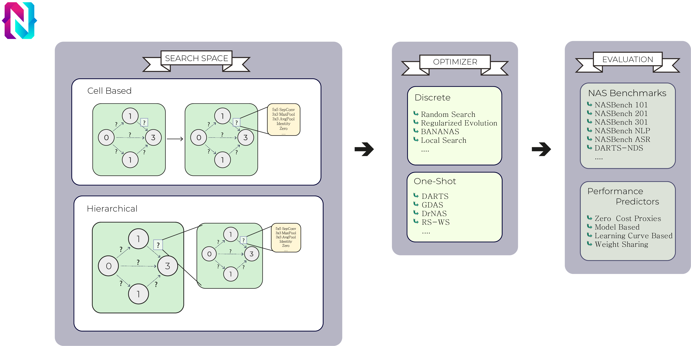
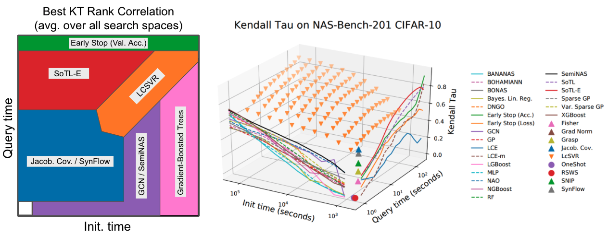

# NASLib
[](https://travis-ci.com/automl/NASLib)
[](https://codecov.io/gh/automl/NASLib)

NASLib is a Neural Architecture Search (NAS) library. Its purpose is to facilitate NAS research for the community by providing interfaces to several state-of-the-art NAS search spaces.

> :warning: **This library is under construction** and there is no official release yet. Feel 
> free to play around and have a look but be aware that the *APIs will be changed* until we have a first release.

It is designed to be modular, extensible and easy to use.



# Usage

```python
search_space = SimpleCellSearchSpace()

optimizer = DARTSOptimizer(config)
optimizer.adapt_search_space(search_space)

trainer = Trainer(optimizer, config)
trainer.search()        # Search for an architecture
trainer.evaluate()      # Evaluate the best architecture
```

For an example file see [`demo.py`](examples/demo.py).

For more extensive documentation see [docs](docs/).

NASLib has been used to run an extensive comparison of 31 performance predictors. See the separate readme: <a href="docs/predictors.md">predictors.md</a>
and our paper: <a href="https://arxiv.org/abs/2104.01177">How Powerful are Performance Predictors in Neural Architecture Search?</a>
<p align="center">
  
</p>

# Requirements

Make sure you use the latest version of pip. It makes sense to set up a virtual environment, too.

```
python3 -m venv naslib
source naslib/bin/activate

pip install --upgrade pip setuptools wheel
pip install cython pytest
```

# Installation

Clone and install.

If you plan to modify naslib consider adding the `-e` option for `pip install`.

```
git clone https://github.com/automl/NASLib.git
cd naslib
python setup.py develop 

pip install torch==1.8.1+cpu torchvision==0.9.1+cpu torchaudio==0.8.1 -f https://download.pytorch.org/whl/torch_stable.html


```

To validate the installation, you can run tests:

```
cd tests
coverage run -m unittest discover
```

The test coverage can be seen with `coverage report`.


## Cite

If you use this code in your own work, please use the following bibtex entries:

```bibtex
@misc{naslib-2020, 
  title={NASLib: A Modular and Flexible Neural Architecture Search Library}, 
  author={Ruchte, Michael and Zela, Arber and Siems, Julien and Grabocka, Josif and Hutter, Frank}, 
  year={2020}, publisher={GitHub}, 
  howpublished={\url{https://github.com/automl/NASLib}} }
  
@article{white2021powerful,
  title={How Powerful are Performance Predictors in Neural Architecture Search?},
  author={White, Colin and Zela, Arber and Ru, Binxin and Liu, Yang and Hutter, Frank},
  journal={arXiv preprint arXiv:2104.01177},
  year={2021}
}
```
