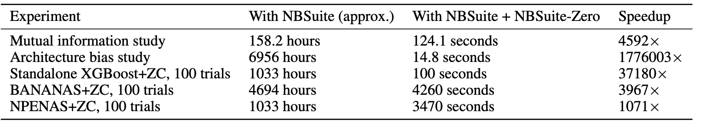
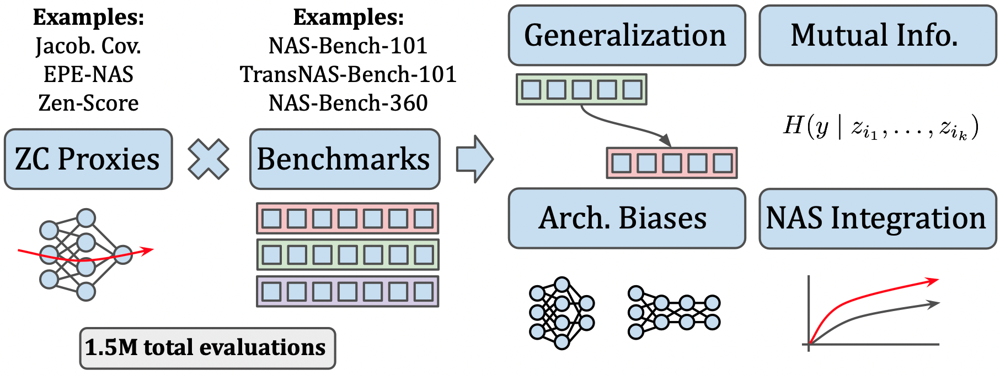
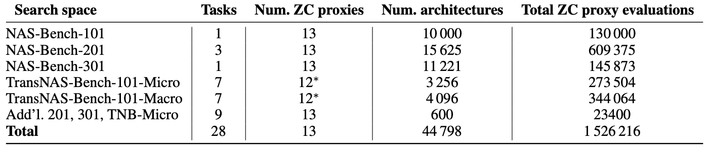
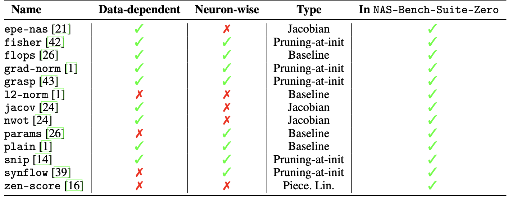

<h1  align="center" > ℕ𝔸𝕊-𝔹𝕖𝕟𝕔𝕙-𝕊𝕦𝕚𝕥𝕖-ℤ𝕖r𝕠:  </h1>


<div align=justify>

`NAS-Bench-Suite-Zero` is a dataset and unified codebase for ZC proxies, enabling orders-of-magnitude faster experiments on ZC proxies, while avoiding confounding factors stemming from different implementations.

As a benchmark, `NAS-Bench-Suite-Zero` contains precomputed scores of 13 ZC proxies on 100 to 15625 architectures on 28 tasks, with a total of 1.5M total evaluations. It can be used to run large-scale analyses of ZC proxies, including studies on generalizability and bias of ZC proxies, analyzing mutual information, or integrating ZC proxies into NAS algorithms. 
</div>

<p> Runtimes (on an Intel Xeon Gold 6242 CPU) for all types of experiments done in this paper, with and without NAS-Bench-Suite-Zero:</p>
<div align="center">
  
</div>
<br>

<p> Overview of how NAS-Bench-Suite-Zero facilitates NAS research:
<div align="center">
  
</div>
<br>

<p> NAS search spaces and zero-cost proxies studied in NAS-Bench-Suite-Zero: 
<div align="center">
  
  
</div>
<br>

<h3> Quick Links: </h3>

[**Setup**](#setup)
| [**Data**](#data)
| [**Experiments**](#experiments)
| [**Visualizations**](#visualizations)

# Setup

While installing the repository, creating a new conda environment is recomended. [Install PyTorch GPU/CPU](https://pytorch.org/get-started/locally/) for your setup.

```bash
git clone -b zerocost https://github.com/automl/NASLib/
cd NASLib
conda create -n zerocost  python=3.7
conda activate zerocost
```

Run setup.py file with the following command, which will install all the packages listed in [`requirements.txt`](requirements.txt).
```bash
pip install --upgrade pip setuptools wheel
pip install -e .
```
# Data

Download all the ZC proxies evaluations, which contains the scores for each proxy and validation accuracy for each architecutre. The ```gdown (pip install gdown)``` package is required to download from google drive. The following command will download the data.

```bash
source scripts/bash_scripts/download_nbs_zero.sh <search_space>
source scripts/bash_scripts/download_nbs_zero.sh nb201
source scripts/bash_scripts/download_nbs_zero.sh all
```

Download all the NAS benchmarks and their associated datasets ( for mac users, please make sure you have wget installed).
```bash
source scripts/bash_scripts/download_data.sh all 
```
Alternatively, you can download the benchmark for a specific search space and dataset/task as follows:
```bash
source scripts/bash_scripts/download_data.sh <search_space> <dataset> 
source scripts/bash_scripts/download_data.sh nb201 cifar10
source scripts/bash_scripts/download_data.sh nb201 all 
```

<!---
Download the TransNAS-Bench-101 benchmark from [here](https://www.noahlab.com.hk/opensource/vega/page/doc.html?path=datasets/transnasbench101) unzip the folder and place the benchmark `transnas-bench_v10141024.pth` from this folder in `NASLib/naslib/data/..`

If you face issues downloading the datasets please follow the steps [here](dataset_preparation/).
-->

# Experiments 
See [`naslib/runners`](naslib/runners) for specific experiment scripts. Here we provide instructions for running experiments en masse. Note that the correlation experiments requires SLURM on your machine. Please contact us if you have any questions.

## Reproduce ZC proxy correlation experiments  
```bash
cd configs
unzip configs/correlation.zip 
source scripts/cluster/correlation/run_{benchmark}.sh 
source scripts/cluster/correlation/run_all.sh 
(runner: naslib/runners/runner.py)
```
After the scores are generated, visualizations of correlation results are generated in  ```plotting/PlotCorrelations.ipynb```. 

## Reproduce XGBoost + ZC proxy correlation experiments
```bash
cd configs
unzip configs/xgb_configs.zip 
source scripts/cluster/xgb_correlation/run_{benchmark}.sh 
source scripts/cluster/xgb_correlation/run_all.sh 
(runner: naslib/runners/bbo/xgb_runner.py)
```
After the scores are generated, visualizations of correlation results are generated in  ```plotting/PlotXGBCorrelations.ipynb```.


## Reproduce predictor-guided NAS (BANANAS) experiments
After downloading the data, run the following commands to reproduce the predictor-guided NAS experiments.

```bash
cd configs
unzip configs/bananas.zip 
source scripts/cluster/zc_ensembles/run_{benchmark}.sh {[only_zc, only_adjacency, zc_and_adjacency]} {n_seeds}
source scripts/cluster/zc_ensembles/run_all.sh 
(runner: naslib/runners/bbo/runner.py)
```
After the scores are generated, visualizations of correlation results are generated in  ```plotting/PlotEnsembles.ipynb```. You can regenerate configs for NPENAS using ```scripts/create_configs_zc_ensembles.py``` and modifying the optimizer flag. 

# Visualizations
Check out the jupyter notebooks in [`plotting`](plotting) for visualizations of information theory plots, correlation plots, etc.  

For information theory plots, see ```plotting/PlotMutualInformation.ipynb``` and ```PlotProxies.ipynb```. <br>
For bias results, see ```plotting/BiasExperiments.ipynb```. <br>
