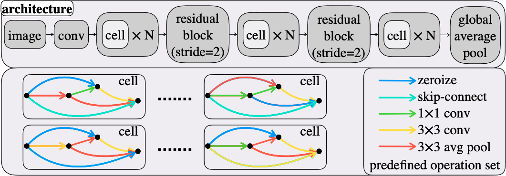

# Tutorial

This tutorial assumes that you are completely new to NASLib, and will introduce you to the core ideas and APIs of the library. By the end of it, you will know everything you need to know to make a submission to the [Zero-Cost NAS Competition](link here).

## Introduction to Search Spaces

Let's begin by taking a look [NAS-Bench-201](https://arxiv.org/abs/2001.00326) search space as an example:



As you can see, the architecture consists of multiple *cells* stacked together with residual blocks in between which downsample the feature maps. Each cell has 6 edges, each of which could hold one of 5 operations from a predefined operation set.

Let's first create a search space in NASLib:


```python
from naslib.search_spaces import NasBench201SearchSpace
search_space = NasBench201SearchSpace(n_classes=10)
search_space
```


    Graph makrograph-0.3161564, scope None, 20 nodes


Equivalently, you could also create the search space as follows:


```python
from naslib.search_spaces import get_search_space
search_space = get_search_space(name='nasbench201', dataset='cifar10')
search_space
```


    Graph makrograph-0.6456528, scope None, 20 nodes


`Graphs` in NASLib inherit from both [PyTorch Module](https://pytorch.org/docs/stable/generated/torch.nn.Module.html) as well as [NetworkX DiGraph](https://networkx.org/documentation/stable/reference/classes/digraph.html). It uses [NetworkX](https://networkx.org/) to create the architecture structure, which can later be parsed to create a standard PyTorch Module.

Here's a closer look at the search_space graph that we just created:


```python
print('Nodes in the graph:', search_space.nodes())
print('Edges in the graph:', search_space.edges())
```

    Nodes in the graph: [1, 2, 3, 4, 5, 6, 7, 8, 9, 10, 11, 12, 13, 14, 15, 16, 17, 18, 19, 20]
    Edges in the graph: [(1, 2), (2, 3), (3, 4), (4, 5), (5, 6), (6, 7), (7, 8), (8, 9), (9, 10), (10, 11), (11, 12), (12, 13), (13, 14), (14, 15), (15, 16), (16, 17), (17, 18), (18, 19), (19, 20)]


Every node and edge of the `Graph` can hold operations, which could be either a PyTorch `Module` or another `Graph`. 


```python
print('Operation on edge 1-2 of the graph:', search_space.edges[1, 2]['op']) # Pytorch Module as 'op' on the edge
print('Operation on edge 2-3 of the graph:', search_space.edges[2, 3]['op']) # NASLib Graph as 'op' on the edge
```

    Operation on edge 1-2 of the graph: Stem(
      (seq): Sequential(
        (0): Conv2d(3, 16, kernel_size=(3, 3), stride=(1, 1), padding=(1, 1), bias=False)
        (1): BatchNorm2d(16, eps=1e-05, momentum=0.1, affine=True, track_running_stats=True)
      )
    )
    Operation on edge 2-3 of the graph: Graph named 'cell' with 4 nodes and 6 edges


Here's a closer look at a cell:


```python
cell = search_space.edges[2, 3]['op']
print('Nodes in the cell:', cell.nodes())
print('Edges in the cell:', cell.edges())
```

    Nodes in the cell: [1, 2, 3, 4]
    Edges in the cell: [(1, 2), (1, 3), (1, 4), (2, 3), (2, 4), (3, 4)]


The cell graph thus has the same structure as the cell shown in the NAS-Bench-201 architecture figure. Let's now look at what is present on the edges of the cell.


```python
print(f'Operations on edge 1-2 of cell:')
print(cell.edges[1, 2]['op'])
```

    Operations on edge 1-2 of cell:
    [Identity(), Zero (stride=1), ReLUConvBN(
      (op): Sequential(
        (0): ReLU()
        (1): Conv2d(16, 16, kernel_size=(3, 3), stride=(1, 1), padding=(1, 1), bias=False)
        (2): BatchNorm2d(16, eps=1e-05, momentum=0.1, affine=False, track_running_stats=False)
      )
    ), ReLUConvBN(
      (op): Sequential(
        (0): ReLU()
        (1): Conv2d(16, 16, kernel_size=(1, 1), stride=(1, 1), bias=False)
        (2): BatchNorm2d(16, eps=1e-05, momentum=0.1, affine=False, track_running_stats=False)
      )
    ), AvgPool1x1(
      (avgpool): AvgPool2d(kernel_size=3, stride=1, padding=1)
    )]


All edges on the cell have a list of candidate operations on them, as seen above. The candidate operations here are Identity, Zero, ReLU-3x3Convolution-BatchNorm, ReLU-1x1Convolution-BatchNorm, and a 1x1AveragePool. You can uncomment and run the next lines to see all the edges.


```python
# for edge in cell.edges:
#     print('%'*50)
#     print(f'Operations on edge 1-2 of cell:')
#     print(cell.edges[edge]['op'])
```

## Sampling random models

Let's now sample a random architecture from the search space.


```python
graph = search_space.clone() # Clone the search space first
cell = graph.edges[2, 3]['op']
show_only_one_edge = True

# Initially, the operation on an edge is simply a list of all candidate operations
print('Before sampling operation')
print('Operation on edge 1-2:', cell.edges[1, 2]['op'])

# Sample a random architecture
graph.sample_random_architecture()

# After sampling, it is replaced by one operation from the list
print('\nAfter sampling operation')
for edge in cell.edges():
    print(f'Operation on edge {edge}:', cell.edges[edge]['op'])

# Get the representation of this architecture:
print('\nArchitecture encoding:', graph.get_hash())
```

    Before sampling operation
    Operation on edge 1-2: [Identity(), Zero (stride=1), ReLUConvBN(
      (op): Sequential(
        (0): ReLU()
        (1): Conv2d(16, 16, kernel_size=(3, 3), stride=(1, 1), padding=(1, 1), bias=False)
        (2): BatchNorm2d(16, eps=1e-05, momentum=0.1, affine=False, track_running_stats=False)
      )
    ), ReLUConvBN(
      (op): Sequential(
        (0): ReLU()
        (1): Conv2d(16, 16, kernel_size=(1, 1), stride=(1, 1), bias=False)
        (2): BatchNorm2d(16, eps=1e-05, momentum=0.1, affine=False, track_running_stats=False)
      )
    ), AvgPool1x1(
      (avgpool): AvgPool2d(kernel_size=3, stride=1, padding=1)
    )]
    
    After sampling operation
    Operation on edge (1, 2): Identity()
    Operation on edge (1, 3): ReLUConvBN(
      (op): Sequential(
        (0): ReLU()
        (1): Conv2d(16, 16, kernel_size=(3, 3), stride=(1, 1), padding=(1, 1), bias=False)
        (2): BatchNorm2d(16, eps=1e-05, momentum=0.1, affine=True, track_running_stats=True)
      )
    )
    Operation on edge (1, 4): Zero (stride=1)
    Operation on edge (2, 3): Zero (stride=1)
    Operation on edge (2, 4): Identity()
    Operation on edge (3, 4): ReLUConvBN(
      (op): Sequential(
        (0): ReLU()
        (1): Conv2d(16, 16, kernel_size=(1, 1), stride=(1, 1), bias=False)
        (2): BatchNorm2d(16, eps=1e-05, momentum=0.1, affine=True, track_running_stats=True)
      )
    )
    
    Architecture encoding: (0, 2, 1, 1, 0, 3)


To create the PyTorch model, one needs only to parse this `Graph` as follows:


```python
import torch

# Create the graph
graph = search_space.clone()
graph.sample_random_architecture()

# Parse the graph
print('Sub modules in the graph before parsing', list(graph.children()))
graph.parse()
print('\nSub modules in the graph after parsing', list(graph.children()))

# Test the graph with a forward pass of a small random minibatch
result = graph(torch.randn(1, 3, 32, 32))
print('\nResult:', result)
```

    Sub modules in the graph before parsing []
    
    Sub modules in the graph after parsing [Stem(
      (seq): Sequential(
        (0): Conv2d(3, 16, kernel_size=(3, 3), stride=(1, 1), padding=(1, 1), bias=False)
        (1): BatchNorm2d(16, eps=1e-05, momentum=0.1, affine=True, track_running_stats=True)
      )
    ), Graph cell-0.3683700, scope stage_1, 4 nodes, Graph cell-0.7152342, scope stage_1, 4 nodes, Graph cell-0.8219054, scope stage_1, 4 nodes, Graph cell-0.5814143, scope stage_1, 4 nodes, Graph cell-0.6844618, scope stage_1, 4 nodes, ResNetBasicblock(
      (conv_a): ReLUConvBN(
        (op): Sequential(
          (0): ReLU()
          (1): Conv2d(16, 32, kernel_size=(3, 3), stride=(2, 2), padding=(1, 1), bias=False)
          (2): BatchNorm2d(32, eps=1e-05, momentum=0.1, affine=True, track_running_stats=True)
        )
      )
      (conv_b): ReLUConvBN(
        (op): Sequential(
          (0): ReLU()
          (1): Conv2d(32, 32, kernel_size=(3, 3), stride=(1, 1), padding=(1, 1), bias=False)
          (2): BatchNorm2d(32, eps=1e-05, momentum=0.1, affine=True, track_running_stats=True)
        )
      )
      (downsample): Sequential(
        (0): AvgPool2d(kernel_size=2, stride=2, padding=0)
        (1): Conv2d(16, 32, kernel_size=(1, 1), stride=(1, 1), bias=False)
      )
    ), Graph cell-0.9210311, scope stage_2, 4 nodes, Graph cell-0.6900291, scope stage_2, 4 nodes, Graph cell-0.4307776, scope stage_2, 4 nodes, Graph cell-0.7351776, scope stage_2, 4 nodes, Graph cell-0.6478630, scope stage_2, 4 nodes, ResNetBasicblock(
      (conv_a): ReLUConvBN(
        (op): Sequential(
          (0): ReLU()
          (1): Conv2d(32, 64, kernel_size=(3, 3), stride=(2, 2), padding=(1, 1), bias=False)
          (2): BatchNorm2d(64, eps=1e-05, momentum=0.1, affine=True, track_running_stats=True)
        )
      )
      (conv_b): ReLUConvBN(
        (op): Sequential(
          (0): ReLU()
          (1): Conv2d(64, 64, kernel_size=(3, 3), stride=(1, 1), padding=(1, 1), bias=False)
          (2): BatchNorm2d(64, eps=1e-05, momentum=0.1, affine=True, track_running_stats=True)
        )
      )
      (downsample): Sequential(
        (0): AvgPool2d(kernel_size=2, stride=2, padding=0)
        (1): Conv2d(32, 64, kernel_size=(1, 1), stride=(1, 1), bias=False)
      )
    ), Graph cell-0.3437835, scope stage_3, 4 nodes, Graph cell-0.5114087, scope stage_3, 4 nodes, Graph cell-0.7046120, scope stage_3, 4 nodes, Graph cell-0.2255598, scope stage_3, 4 nodes, Graph cell-0.6411812, scope stage_3, 4 nodes, Sequential(
      (op): Sequential(
        (0): BatchNorm2d(64, eps=1e-05, momentum=0.1, affine=True, track_running_stats=True)
        (1): ReLU(inplace=True)
        (2): AdaptiveAvgPool2d(output_size=1)
        (3): Flatten(start_dim=1, end_dim=-1)
        (4): Linear(in_features=64, out_features=10, bias=True)
      )
    )]
    
    Result: tensor([[-0.1394, -0.0561,  0.3482, -0.1860, -0.1104,  0.1221,  0.2481,  0.1997,
             -0.4143, -0.2007]], grad_fn=<AddmmBackward>)


## Querying the performance of a model

NAS-Bench-201 has 15,625 models in its search space, all of which have been evaluated for classification task on three separate datasets - CIFAR10, CIFAR100, and ImageNet-16-120. Given the architecture encoding of a model, one can simply query the benchmark to see its final performance for any one of these tasks.

The first thing to do is to ensure that you have the benchmark data files. For now, we will download and test only the NAS-Bench-201 benchmark for the CIFAR10 task. If you've already downloaded the data and tested the API, you can skip this step.


```python
!sh scripts/bash_scripts/download_data.sh nb201 cifar10
!python test_benchmark_apis.py --search_space nasbench201 --task cifar10 --show_error
```

    sh: scripts/bash_scripts/download_data.sh: No such file or directory
    python: can't open file 'test_benchmark_apis.py': [Errno 2] No such file or directory


```python
# Convenience function to sample a new model from the given search space and parse it
def sample_and_parse_graph(name='nasbench201', dataset='cifar10'):
    search_space = get_search_space(name, dataset)
    search_space.sample_random_architecture()
    search_space.parse()
    return search_space
```

Now, lets sample a model from the search space and query its validation performance.


```python
# First, load the benchmark API.
from naslib.utils import get_dataset_api
dataset_api = get_dataset_api('nasbench201', 'cifar10')

# Sample a random architecture model
graph = sample_and_parse_graph()

# Show architecture encoding
from naslib.search_spaces.nasbench201.conversions import convert_naslib_to_str

print(f'Compact model representation is: {graph.get_hash()}')
print(f'NAS-Bench-201 representation is: {convert_naslib_to_str(graph)}')

# Query the benchmark
from naslib.search_spaces.core.query_metrics import Metric
val_accuracy = graph.query(
    metric=Metric.VAL_ACCURACY,
    dataset='cifar10',
    dataset_api=dataset_api
)

print(f'Validation accuracy: {val_accuracy}\n')
```

    Compact model representation is: (3, 4, 2, 1, 3, 0)
    NAS-Bench-201 representation is: |nor_conv_1x1~0|+|avg_pool_3x3~0|none~1|+|nor_conv_3x3~0|nor_conv_1x1~1|skip_connect~2|
    Validation accuracy: 88.47
    


## Zero Cost Predictors
Let's now move on to trying the zero cost predictors already available in NASLib.


```python
""" Evaluates a ZeroCost predictor for a search space and dataset/task"""
from naslib.predictors import ZeroCost
from naslib.utils import utils
import numpy as np

# Get the configs from naslib/configs/predictor_config.yaml (and the command line arguments, if any)
# The configs include the zero-cost method to use, the search space and dataset/task to use,
# amongst others.
config = utils.get_config_from_args()
# print(config)

# Initialize the predictor
# Method type can be "fisher", "grasp", "grad_norm", "jacov", "snip", "synflow", "flops" or "params"
predictor = ZeroCost(config, batch_size=config.batch_size, method_type=config.predictor)

# Make the ZeroCost predictor ready for prediction
# In this case, that involves loading the data loaders for CIFAR10
predictor.pre_process()

# Create the models to score
n = 10
print(f'Sampling {n} models...')
models = [sample_and_parse_graph() for i in range(n)]

# Score each model
print('Scoring models with predictor ...')
scores = [predictor.query(model) for model in models]

# Query benchmarks to get the actual scores
print('Querying benchmarks for actual scores...')
actual_scores = [
        model.query(
            metric=Metric.VAL_ACCURACY,
            dataset='cifar10',
            dataset_api=dataset_api
        ) for model in models
    ]

print('Done.')
```

    Files already downloaded and verified
    Files already downloaded and verified
    Sampling 10 models...
    Scoring models with predictor ...
    Querying benchmarks for actual scores...
    Done.


The Kendall Tau correlation of the predicted and actual scores is the metric of interest in the competition.


```python
from scipy import stats
stats.kendalltau(scores, actual_scores)
```


    KendalltauResult(correlation=0.5555555555555555, pvalue=0.02860945767195767)


To make the evaluation of predictors more convenient, `PredictorEvaluator` class is provided to you.


```python
from naslib.evaluators.zc_evaluator import PredictorEvaluator
from naslib.utils import setup_logger
import logging

# Set up logger
logger = setup_logger(config.save + "/log.log")
logger.setLevel(logging.INFO)

# Change the default test_size in configs
config.test_size = 14

# Initialize the PredictorEvaluator class
predictor_evaluator = PredictorEvaluator(predictor, config=config)
predictor_evaluator.adapt_search_space(search_space, dataset_api=dataset_api)

# Evaluate the predictor
results = predictor_evaluator.evaluate()
results[-1]['kendalltau']
```

    Files already downloaded and verified
    Files already downloaded and verified
    [04/04 21:03:32 nl.evaluators.zc_evaluator]: Loading the test set...
    [04/04 21:03:32 nl.evaluators.zc_evaluator]: Sampling from search space...
    [04/04 21:03:35 nl.evaluators.zc_evaluator]: Loading the training set
    [04/04 21:03:35 nl.evaluators.zc_evaluator]: Sampling from search space...
    [04/04 21:03:35 nl.evaluators.zc_evaluator]: Fitting the predictor...
    [04/04 21:03:35 nl.evaluators.zc_evaluator]: Querying the predictor...


    100%|███████████████████████████████████████████████████████████████████████████████████████████████████████████████████████████████████████████████████████████████████████| 14/14 [00:10<00:00,  1.34it/s]

    [04/04 21:03:45 nl.evaluators.zc_evaluator]: Compute evaluation metrics
    dataset: cifar10, predictor: synflow, spearman 0.7451
    [04/04 21:03:45 nl.evaluators.zc_evaluator]: mae: 2.561165989669785e+40, rmse: 9.545006077219512e+40, pearson: 0.2369, spearman: 0.7451, kendalltau: 0.5604, kt_2dec: 0.5604, kt_1dec: 0.5604, precision_10: 0.9, precision_20: 0.6, full_ytest: [86.77 71.92 85.18 89.47 87.4  84.85 85.19 89.01 85.17 89.89 87.12 84.12
     89.44 85.69], full_testpred: [2.07672438e+19 2.58500748e+06 2.96844875e+25 2.03657231e+35
     1.38303827e+31 2.48829083e+32 2.25192877e+23 2.03214661e+26
     4.68308787e+15 1.42445038e+39 1.88683860e+19 2.48598392e+06
     3.57138584e+41 1.58866766e+18], train_time: 26.0556, fit_time: 0.0, query_time: 0.7487, 


    


    0.5604395604395604


## Sample Submission

Now, you're ready to create a sample submission for the competition. In this example, we're going to write a very simple zero-cost predictor, which simply counts the number of parameters in the model. The predictor thus assigns higher score to bigger models.


```python
from naslib.predictors.predictor import Predictor

def count_parameters(model):
    return sum(p.numel() for p in model.parameters())

class ZeroCostPredictor(Predictor):
    '''Your predictor class MUST be named ZeroCostPredictor'''
    def __init__(self):
        self.method_type = 'count_params'

    def pre_process(self):
        pass

    def query(self, xtest, info=None):
        graph = xtest
        score = count_parameters(graph)
        # Higher the score, higher the ranking of the model
        return score
```

For the submission to be complete, the class `ZeroCostPredictor` must be saved in a file named `predictor.py` and zipped together with an empty `metdata` file.


```python
!mkdir sample_submission
!touch sample_submission/metadata
!zip sample_submission.zip sample_submission/*
```

    mkdir: sample_submission: File exists
    updating: sample_submission/metadata (stored 0%)
    updating: sample_submission/predictor.py (deflated 49%)


```python

```
